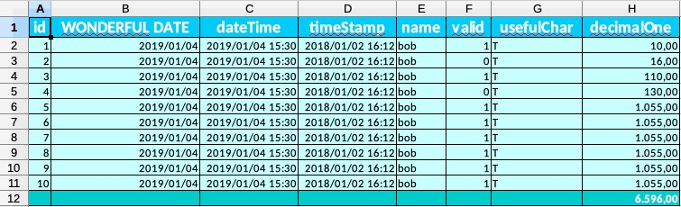
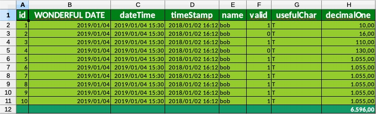
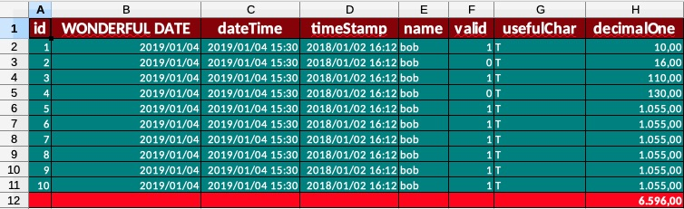
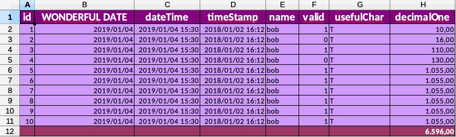
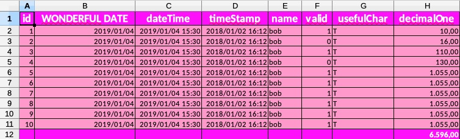
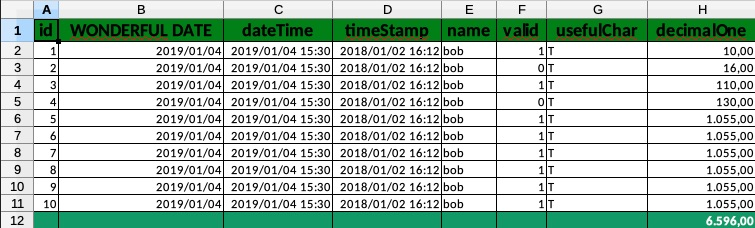
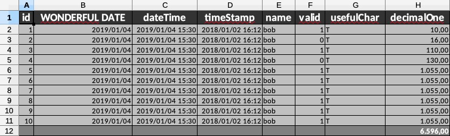
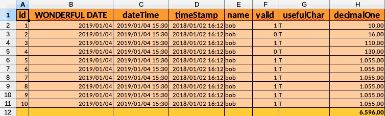

# MemPOI
A library to simplify export from database to Excel files using Apache POI

---

<link type="text/css" rel="stylesheet" href="readme.css" />

  

    
Plain Apache POI

    

      
this.workbook = new SXSSFWorkbook();
      

      
SXSSFSheet sheet = workbook.createSheet("Dogs");
      

      
CellStyle headerStyle = workbook.createCellStyle();

      
headerStyle.setFillForegroundColor(

      
IndexedColors.GREEN.getIndex());

      
headerStyle.setFillPattern(

      
FillPatternType.SOLID_FOREGROUND);

      
Row row = sheet.createRow(0);

      
Cell cell1 = row.createCell(0);

      
cell1.setCellValue("Dog name");

      
cell1.setCellStyle(headerStyle);

      
Cell cell2 = row.createCell(1);

      
cell2.setCellValue("Dog race");

      
cell2.setCellStyle(headerStyle);

      
Cell cell3 = row.createCell(2);

      
cell3.setCellValue("Dog age");

      
cell3.setCellStyle(headerStyle);

      
Cell cell4 = row.createCell(2);

      
cell4.setCellValue("Dog owner");

      
cell4.setCellStyle(headerStyle);

    

    

      
ResultSet rs = preparedStatement.executeQuery();

      
int rowNumber = 1;

      
while(rs.next()) {

      
Row row = sheet.createRow(this.rowNumber++);
      

      
Cell cell1 = row.createCell(0);

      
cell1.setCellValue(rs.getString("dog_name"));

      
cell1.setStyle(this.createNormalStyle());

      
cell1.getStyle().setVerticalAlignment(valign);

      
Cell cell2 = row.createCell(0);

      
cell2.setCellValue(rs.getString("dog_race"));

      
cell2.setStyle(this.createNormalStyle());

      
Cell cell3 = row.createCell(1);

      
cell3.setCellValue(rs.getInt("dog_age"));

      
cell3.setStyle(this.createNumericStyle());

      
cell4.getStyle().setVerticalAlignment(valign);

      
Cell cell4 = row.createCell(2);

      
cell4.setCellValue(rs.getInt("dog_owner"));

      
cell4.setStyle(this.createNormalStyle());

      
cell4.getStyle().setVerticalAlignment(valign);

      
}

    

    

      
Row row = sheet.createRow(rowNumber);

      
Cell cell1 = row.createCell(0);

      
cell1.setCellValue("");

      
cell1.setCellStyle(headerStyle);

      
Cell cell2 = row.createCell(1);

      
cell2.setCellValue("");

      
cell2.setCellStyle(headerStyle);

      
Cell cell3 = row.createCell(2);

      
cell3.setCellValue("");

      
cell3.setCellStyle(headerStyle);

      
cell3.setCellFormula("SUM(D2:D50)");

      
Cell cell4 = row.createCell(3);

      
cell4.setCellValue("Dog owner");

      
cell4.setCellStyle(headerStyle);

      
try (ByteArrayOutputStream bos =

      
new ByteArrayOutputStream()) {

      
this.workbook.write(bos);

      
return bos.toByteArray();

      
}

      
this.workbook.dispose();

      
this.workbook.close();

      
rs.close();

    

  

  

    
MemPOI Powered

    

      
new MempoiBuilder()

      
.addMempoiSheet(new MempoiSheet(prepStmt, "Dogs"))

      
.build()

      
.prepareMempoiReportToByteArray();

    

    
MemPOI Powered

    

  

---

MemPOI is not designed to be used with an ORM due to performance needs on massive exports.

Java 8+ required

### Basic usage

All you need is to instantiate a MemPOI and to pass it the List of your exporting queries. MemPOI will do all the stuff for you generating a .xlsx file containing resulting data.
You need to pass your export queries as a List of `MempoiSheet` (`PreparedStatement` + sheet name).
You can use `MempoiBuilder` to correctly populate your MemPOI instance, like follows:

<pre>
MemPOI memPOI = new MempoiBuilder()
                        .setDebug(true)
                        .addMempoiSheet(new MempoiSheet(prepStmt, "Sheet name"))
                        .build();
                        
CompletableFuture<byte[]> fut = memPOI.prepareMempoiReportToByteArray();
</pre>

You can find more examples in the functional tests package.

By default `SXSSFWorkbook` is used, but these are the supported `Workbook`'s descendant:
- `SXSSFWorkbook`
- `XSSFWorkbook`
- `HSSFWorkbook`

**Multiple sheets supported** - Each `MempoiSheet` will add a sheet to the generated report

---

### File VS byte array

You can choose to write directly to a file or to obtain the byte array of the generated report (for example to pass it back to a waiting client)

File:

<pre>
File fileDest = new File(this.outReportFolder.getAbsolutePath(), "test_with_file.xlsx");
MemPOI memPOI = new MempoiBuilder()
                    .setFile(fileDest)
                    .addMempoiSheet(new MempoiSheet(prepStmt))
                    .build();

CompletableFuture<String> fut = memPOI.prepareMempoiReportToFile();
</pre>

Byte array:

<pre>
// With byte array
MemPOI memPOI = new MempoiBuilder()
                    .addMempoiSheet(new MempoiSheet(prepStmt))
                    .build();

CompletableFuture<byte[]> fut = memPOI.prepareMempoiReportToByteArray();
</pre>

### Supported SQL data types

- BIGINT
- DOUBLE
- DECIMAL
- FLOAT
- NUMERIC
- REAL
- INTEGER
- SMALLINT
- TINYINT
- CHAR
- NCHAR
- VARCHAR
- NVARCHAR
- LONGVARCHAR
- TIMESTAMP
- DATE
- TIME
- BIT
- BOOLEAN
          
---            

**You have to take care to manage your database connection, meanwhile `PreparedStatement` and `ResultSet` are managed and closed internally by MemPOI**

---

### Column headers

Column headers are generated taking export query column names. If you want to choose column headers you need to speficy them with `AS` clause. For example:

`SELECT id, name AS first_name FROM Foo`

will result in a sheet with 2 columns: id and first_name (containing db's name column data)

---

### Multiple sheets

Multiple sheets in the same document are supported: `MempoiBuilder` accept a list of `MempoiSheet`.
Look at this example and the result above:

<pre>
MempoiSheet dogsSheet = new MempoiSheet(conn.prepareStatement("SELECT pet_name AS DOG_NAME, pet_race AS DOG_RACE FROM pets WHERE pet_type = 'dog'"), "Dogs sheet");
MempoiSheet catsSheet = new MempoiSheet(conn.prepareStatement("SELECT pet_name AS CAT_NAME, pet_race AS CAT_RACE FROM pets WHERE pet_type = 'cat'"), "Cats sheet");
MempoiSheet birdsSheet = new MempoiSheet(conn.prepareStatement("SELECT pet_name AS BIRD_NAME, pet_race AS BIRD_RACE FROM pets WHERE pet_type = 'bird'"), "Birds sheet");

MemPOI memPOI = new MempoiBuilder()
                    .setDebug(true)
                    .setFile(fileDest)
                    .setAdjustColumnWidth(true)
                    .addMempoiSheet(dogsSheet)
                    .addMempoiSheet(catsSheet)
                    .addMempoiSheet(birdsSheet)
                    .build();

CompletableFuture<String> fut = memPOI.prepareMempoiReportToFile();
</pre>

---

### Adjust columns width

MemPOI can adjust columns width to fit the longest content by setting to `true` the property `MempoiBuilder.adjustColumnWidth` as follows:

<pre>
MemPOI memPOI = new MempoiBuilder()
                    .setAdjustColumnWidth(true)
                    .addMempoiSheet(new MempoiSheet(prepStmt))
                    .build();
</pre>

**Adjusting columns width for huge dataset could dramatically slow down the generation process**

---

### Styles

MemPOI comes with a preset of default data formatting style for

- header cells
- number data types cells
- date data types cells
- datetime data types cells

The default styles are applied by default. You can inspect them looking at the end of `MempoiReportStyler` class 
If you want to reset the default styles you need to use an empty `CellStyle` when you use `MempoiBuilder`, for example:

<pre>
MemPOI memPOI = new MempoiBuilder()
                    .setWorkbook(workbook)
                    .addMempoiSheet(new MempoiSheet(prepStmt))
                    .setNumberCellStyle(workbook.createCellStyle())     // no default style for number fields
                    .build();
</pre>

Keep in mind that when you use custom styles you need to pass the workbook from outside, otherwise you could encounter problems. This is an example:

<pre>
CellStyle headerCellStyle = workbook.createCellStyle();
headerCellStyle.setFillForegroundColor(IndexedColors.DARK_RED.getIndex());
headerCellStyle.setFillPattern(FillPatternType.SOLID_FOREGROUND);

MemPOI memPOI = new MempoiBuilder()
                    .setDebug(true)
                    .setWorkbook(workbook)
                    .setFile(fileDest)
                    .addMempoiSheet(new MempoiSheet(prepStmt))
                    .setHeaderCellStyle(headerCellStyle)
                    .build();
</pre>                    

MemPOI comes with a set of templates ready to use. You can use them as follows:

<pre>
MemPOI memPOI = new MempoiBuilder()
                    .setWorkbook(workbook)
                    .addMempoiSheet(new MempoiSheet(prepStmt))
                    .setStyleTemplate(new ForestStyleTemplate())
                    .build();
</pre>

List of available templates:

| Name                      |      Image            |
|---------------------------|-----------------------|
| AquaStyleTemplate         |
| ForestStyleTemplate       |
| PanegiriconStyleTemplate  |
| PurpleStyleTemplate       |
| RoseStyleTemplate         |
| StandardStyleTemplate     |
| StoneStyleTemplate        |
| SummerStyleTemplate       |

---

### Footers and subfooters

MemPOI supports standard .xlsx footers and sub footers.
Whereas footers are a simple wrapper of the Excel ones, subfooters are a MemPOI extension that let you add some nice functionalities to your report.
For example, you could choose to add the `NumberSumSubFooter` to your MemPOI report. It will results in an additional line at the end of the sheet containing the sum of the numeric columns.This is an example:

<pre>
MemPOI memPOI = new MempoiBuilder()
                    .setDebug(true)
                    .setWorkbook(workbook)
                    .setFile(fileDest)
                    .addMempoiSheet(new MempoiSheet(prepStmt))
                    .setMempoiSubFooter(new NumberSumSubFooter())
                    .build();
</pre>

List of available subfooters:

- **NumberSumSubFooter**: place a cell containing the sum of the column (works only on numeric comlumns)
- **NumberMaxSubFooter**: place a cell containing the maximum value of the column (works only on numeric comlumns)
- **NumberMinSubFooter**: place a cell containing the minimum value of the column (works only on numeric comlumns)
- **NumberAverageSubFooter**: place a cell containing the average value of the column (works only on numeric comlumns)

By default no footer and no subfooter are appended to the report.

Subfooters are already supported by the MemPOI bundled templates.

**IMPORTANT**: If you want to use a custom subfooter with cell formulas it needs to extend `FormulaSubFooter`

**Accordingly with MS docs: "Headers and footers are not displayed on the worksheet in Normal view — they are displayed only in Page Layout view and on the printed pages"**

---

### Cell formulas

You can specify subfooter's cell formulas by applying a bundled subfooter or creating a custom one.
By default MemPOI tries to postpone formulas evaluation forcing Excel to evaluate them when it will open your report file.
This approach could fail if you use LibreOffice or something similar to open your report file (it could not evaluate formulas opening the document). So by setting `MempoiBuilder.evaluateCellFormulas` to `true` you can avoid this behaviour forcing MemPOI to evaluate cell formulas by itself.

But depending on which type of `Workbook` you are using you could encounter problems by following this way.
For example if you use an `SXSSFWorkbook` and your report is huge, some of your data rows maybe serialized and when MemPOI will try to evaluate cell formulas it will fail.
For this reason MemPOI tries to firstly save the report to a temporary file, then reopening it without using `SXSSFWorkbook`, applying cell formulas and continuing with the normal process.

Also this approach may fail because of that not using a `SXSSFWorkbook` will create a lot of memory problems if the dataset is huger than the memory heap can support.
To solve this issue you could extend your JVM heap memory with the option `-Xmx2048m`

So actully the best solution for huge dataset is to force Excel to evaluate cell formulas when the report is open.

---

### Performance

Because you could have to face foolish requests like to export hundreds of thousands of rows in a few seconds I have added some speed test.
There are 2 options that may dramatically slow down generation process on huge datasets:

- `adjustColumnWidth`
- `evaluateCellFormulas`

Both available into `MempoiBuilder` they could block your export or even bring it to fail.
Keep in mind that if you can't use them for performance problems you could ask in exchange for speed that columns resizing and cell formula evaluations will be hand made by the final user.

---

#### Special thanks

Special thanks to [Colle der Fomento](http://www.collederfomento.net/) that inspired MemPOI name with their new, fantastic, yearned LP, in particular with their song [Mempo](https://youtu.be/xy05iaknmcY).

Don't you know what I'm talking about? Discover what a [mempo](https://en.wikipedia.org/wiki/Men-yoroi) is! 