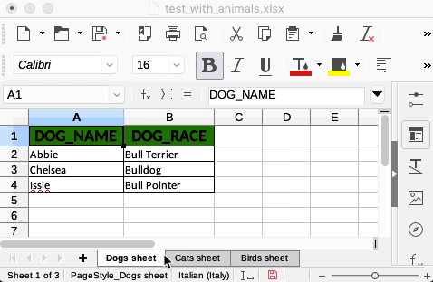
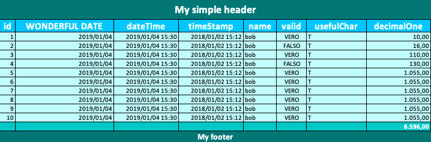
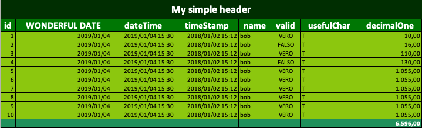
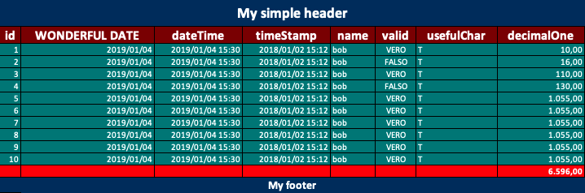
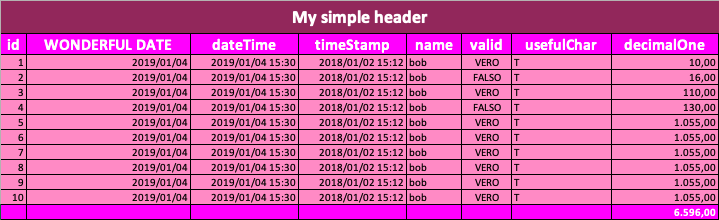
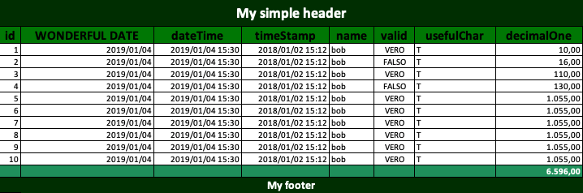
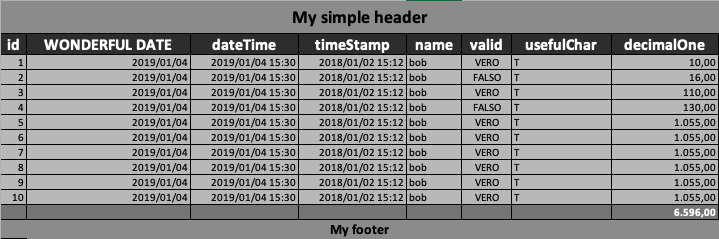
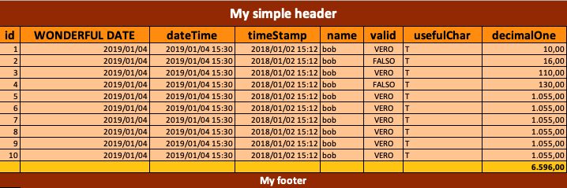
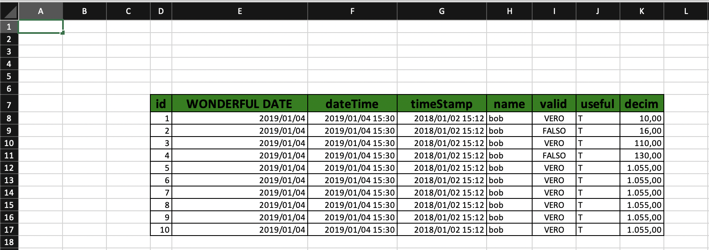

[](https://www.codacy.com/gh/firegloves/MemPOI/dashboard?utm_source=github.com&amp;utm_medium=referral&amp;utm_content=firegloves/MemPOI&amp;utm_campaign=Badge_Coverage)
[](https://www.codacy.com/gh/firegloves/MemPOI/dashboard?utm_source=github.com&amp;utm_medium=referral&amp;utm_content=firegloves/MemPOI&amp;utm_campaign=Badge_Grade)
[](https://opensource.org/licenses/MIT)


[](https://github.com/firegloves/MemPOI/actions/workflows/build-and-test.yml)
[](https://github.com/firegloves/MemPOI/actions/workflows/code-coverage.yml)
[](https://github.com/firegloves/MemPOI/actions/workflows/publish-to-staging-repo-maven-central.yml)


[](https://snyk.io/test/github/firegloves/mempoi)

# MemPOI :green_book: &nbsp; :arrow_right: &nbsp; :japanese_goblin: &nbsp; :arrow_right: &nbsp; :tropical_drink:
A library to simplify export from database to Excel files using Apache POI

MemPOI is not designed to be used with an ORM due to performance needs on massive exports.

A short <a href="https://medium.com/@lucorset/mempoi-a-mempo-mask-for-apache-poi-to-let-you-conquer-freedom-and-sip-a-good-mojito-on-the-930e1ca337d8">story about Mempoi's birth</a>

### Support

- Apache POI 4.0.0+
- Java 8+

---

### Import

#### With Gradle

```Groovy
implementation group: 'it.firegloves', name: 'mempoi', version: '1.9.0'
```

#### With Maven

```XML
<dependency>
    <groupId>it.firegloves</groupId>
    <artifactId>mempoi</artifactId>
    <version>1.9.0</version>
</dependency>
```

---

### What's new in 1.9.0
- NEW FUNCTIONALITY - [Simple text header](#simple-text-header)
- NEW FUNCTIONALITY - [Simple text footer](#simple-text-footer)
- SECURITY - [Vulnerable dependency management](#vulnerable-dependency-management)
- BUG FIX - Fixed bug preventing sub footer from properly calculating cell formulas combined with column offset

---

Main features index:

- [Basic usage](#basic-usage)
- [File VS byte array](#file-vs-byte-array)
- [Supported SQL data types](#supported-sql-data-types)
- [Column headers](#column-headers)
- [Multiple sheets](#multiple-sheets)
- [Adjust columns width](#adjust-columns-width)
- [Styles](#styles)
- [Simple text header](#simple-text-header)
- [Simple text footer](#simple-text-footer)
- [Footers and subfooters](#footers-and-subfooters)
- [Cell formulas](#cell-formulas)
- [Excel Table](#excel-table)
- [Excel Pivot Table](#excel-pivot-table)
- [Metadata](#metadata)
- [Column Configuration](#column-configuration)
- [Column cell style](#column-cell-style)
- [Data transformation functions](#data-transformation-functions)
- [Encryption](#encryption)
- [Null values over primitives default ones](#null-values-over-primitives-default-ones)
- [Data post elaboration pipeline](#data-post-elaboration-pipeline)
- [Merged Regions](#merged-regions)
- [Column and Row offsets](#column-and-row-offsets)
- [Force Generation](#force-generation)
- [Logging](#logging)
- [Vulnerable dependency management](#vulnerable-dependency-management)
- [Donate crypto](#donate-crypto)

---

### MemPOI survey

In order to better trace MemPOI usages and decide the next features, I created a [survey](https://lucorset.typeform.com/to/bDIRbY). No subscription is required.

---

### Basic usage

All you need is to instantiate a MemPOI passing it the List of your exporting queries. MemPOI will do all the stuff for you generating a .xlsx file containing resulting data.
You need to pass your export queries as a List of `MempoiSheet` (`PreparedStatement` + sheet name).
You can use `MempoiBuilder` to correctly populate your MemPOI instance, like follows:

```Java
MemPOI memPOI = MempoiBuilder.aMemPOI()
                    .addMempoiSheet(new MempoiSheet(prepStmt))
                    .build();

CompletableFuture<MempoiReport> future = memPOI.prepareMempoiReport();
```

You can find more examples in the functional tests package.

By default `SXSSFWorkbook` is used, but these are the supported `Workbook`'s descendants:
- `SXSSFWorkbook`
- `XSSFWorkbook`
- `HSSFWorkbook`

**Multiple sheets supported** - Each `MempoiSheet` will add a sheet to the generated report

---

### File VS byte array

You can choose to write directly to a file or to obtain the byte array of the generated report (for example to pass it back to a waiting client)

#### File

Simply pass a file to the `MempoiBuilder` and the report will be written on file.
To get the absolute file path where the report has been saved you can access `MempoiReport`'s `file` property.

```Java
File fileDest = new File("test_with_file.xlsx");

MemPOI memPOI = MempoiBuilder.aMemPOI()
                    .withFile(fileDest)
                    .addMempoiSheet(new MempoiSheet(prepStmt))
                    .build();

CompletableFuture<MempoiReport> fut = memPOI.prepareMempoiReport();
MempoiReport mempoiReport = fut.get();
mempoiReport.getFile(); // will return the string absolute path of the generated report file
```

#### Byte array

If you omit to specify a file in the `MempoiBuilder`, MemPOI will write the report on a byte array.
Then you can read the byte array by accessing the `MempoiReport`'s `bytes` property.

```Java
MemPOI memPOI = MempoiBuilder.aMemPOI()
                    .addMempoiSheet (new MempoiSheet(prepStmt))
                    .build();

CompletableFuture<MempoiReport> fut = memPOI.prepareMempoiReport();
MempoiReport mempoiReport = fut.get();
mempoiReport.getBytes(); // will return the byte[] containing the generated report
```

### Supported SQL data types

- BIGINT
- DOUBLE
- DECIMAL
- FLOAT
- NUMERIC
- REAL
- INTEGER
- SMALLINT
- TINYINT
- CHAR
- NCHAR
- VARCHAR
- NVARCHAR
- LONGVARCHAR
- TIMESTAMP
- DATE
- TIME
- BIT
- BOOLEAN
- UUID (Postgres) (thanks to [nanshakov](https://github.com/nanshakov))

---            

**You have to take care to manage your database connection, meanwhile `PreparedStatement` and `ResultSet` are managed and closed internally by MemPOI**

---

### Column headers

Column headers are generated taking export query column names. If you want to choose column headers you can specify them with `AS` clause. For example:

```SQL
SELECT id, name AS first_name FROM Foo
```

will result in a sheet with 2 columns: id and first_name (containing db's name column data)

Starting by version 1.6.0 it is possible to programmatically manage column headings through a specific [Column header customization](#column-header-customization)

---

### Multiple sheets

Multiple sheets in the same document are supported: `MempoiBuilder` accepts a list of `MempoiSheet`.
Look at this example and at the result above:

```Java
MempoiSheet dogsSheet = MempoiSheetBuilder.aMempoiSheet()
                            .withSheetName("Dogs sheet")
                            .withPrepStmt(conn.prepareStatement("SELECT pet_name AS DOG_NAME, pet_race AS DOG_RACE FROM pets WHERE pet_type = 'dog'"))
                            .build();

MempoiSheet catsSheet = MempoiSheetBuilder.aMempoiSheet()
                            .withSheetName("Cats sheet")
                            .withPrepStmt(conn.prepareStatement("SELECT pet_name AS CAT_NAME, pet_race AS CAT_RACE FROM pets WHERE pet_type = 'cat'"))
                            .build();

MempoiSheet birdsSheet = MempoiSheetBuilder.aMempoiSheet()
                            .withSheetName("Birds sheet")
                            .withPrepStmt(conn.prepareStatement("SELECT pet_name AS BIRD_NAME, pet_race AS BIRD_RACE FROM pets WHERE pet_type = 'bird'"))
                            .build();

MemPOI memPOI = MempoiBuilder.aMemPOI()
                            .withFile(fileDest)
                            .withAdjustColumnWidth(true)
                            .addMempoiSheet(dogsSheet)
                            .addMempoiSheet(catsSheet)
                            .addMempoiSheet(birdsSheet)
                            .build();

CompletableFuture<MempoiReport> fut = memPOI.prepareMempoiReport();
String absoluteFileName = fut.get().getFile();

```



---

### Adjust columns width

MemPOI can adjust columns width to fit the longest content by setting to `true` the property `MempoiBuilder.adjustColumnWidth` as follows:

```Java
MemPOI memPOI = MempoiBuilder.aMemPOI()
                    .withAdjustColumnWidth(true)
                    .addMempoiSheet(new MempoiSheet(prepStmt))
                    .build();
```

**Adjusting columns width for huge datasets could dramatically slow down the generation process**

---

### Styles

MemPOI comes with a preset of default data formatting styles for

- header cells
- integer data types cells
- floating-point data types cells
- date data types cells
- datetime data types cells

The default styles are automatically applied. You can inspect them looking at the end of `MempoiReportStyler` class
If you want to reset the default styles you need to use an empty `CellStyle` when you use `MempoiBuilder`, for example:

```Java
MemPOI memPOI = MempoiBuilder.aMemPOI()
                    .withWorkbook(workbook)
                    .addMempoiSheet(new MempoiSheet(prepStmt))
                    .withIntegerCellStyle(workbook.createCellStyle())     // no default style for integer fields
                    .build();
```

This is an example setting a custom CellStyle for header's cells:

```Java
CellStyle headerCellStyle = workbook.createCellStyle();
headerCellStyle.setFillForegroundColor(IndexedColors.DARK_RED.getIndex());
headerCellStyle.setFillPattern(FillPatternType.SOLID_FOREGROUND);

MemPOI memPOI = MempoiBuilder.aMemPOI()
                    .withFile(fileDest)
                    .addMempoiSheet(new MempoiSheet(prepStmt))
                    .withHeaderCellStyle(headerCellStyle)
                    .build();
```                    

MemPOI comes with a set of templates ready to use. You can use them as follows:

```Java
MemPOI memPOI = MempoiBuilder.aMemPOI()
                    .withWorkbook(workbook)
                    .addMempoiSheet(new MempoiSheet(prepStmt))
                    .withStyleTemplate(new ForestStyleTemplate())
                    .build();
```

Actually you can:
- provide different styles for different sheets
- granularly override bundled styles' cell styles

```Java
// SummerStyleTemplate for dogsSheet
MempoiSheet dogsSheet = new MempoiSheet(conn.prepareStatement("SELECT id, creation_date, dateTime, timeStamp AS STAMPONE, name, valid, usefulChar, decimalOne, bitTwo, doublone, floattone, interao, mediano, attempato, interuccio FROM " + TestConstants.TABLE_EXPORT_TEST), "Dogs");
dogsSheet.setStyleTemplate(new SummerStyleTemplate());

// Customized ForestStyleTemplate for catsSheet
CellStyle floatingPointCellStyle = workbook.createCellStyle();
floatingPointCellStyle.setFillForegroundColor(IndexedColors.AQUA.getIndex());
floatingPointCellStyle.setFillPattern(FillPatternType.SOLID_FOREGROUND);

MempoiSheet catsheet = MempoiSheetBuilder.aMempoiSheet()
                                            .withSheetName("Cats")
                                            .withPrepStmt(prepStmt)
                                            .withStyleTemplate(new ForestStyleTemplate())
                                            .withFloatingPointCellStyle(floatingPointCellStyle)           // overrides ForestStyleTemplate's floating-point cell style
                                            .build();
                                            
List<MempoiSheet> sheetList = Arrays.asList(dogsSheet, catsheet);

MemPOI memPOI = MempoiBuilder.aMemPOI()
                    .withWorkbook(workbook)
                    .withFile(fileDest)
                    .withAdjustColumnWidth(true)
                    .withMempoiSheetList(sheetList)
                    //    .setStyleTemplate(new PanegiriconStyleTemplate())     <----- it has no effects because for each sheet a template is specified
                    .withMempoiSubFooter(new NumberSumSubFooter())
                    .withEvaluateCellFormulas(true)
                    .build();
``` 

List of available templates:

| Name                      |      Image            |
|---------------------------|-----------------------|
| AquaStyleTemplate         |
| ForestStyleTemplate       |
| PanegiriconStyleTemplate  |
| PurpleStyleTemplate       |
| RoseStyleTemplate         |
| StandardStyleTemplate     |
| StoneStyleTemplate        |
| SummerStyleTemplate       |

#### Numeric cell styles

Numeric data types (and the corresponding cell styles) are now split between integer and floating-point data types. This means that from version 1.3.0 database integer data types will be exported without numbers after comma. You can still specify a custom cell style or explicitly use one of the available ones.
For example in order use pre v1.3.0 integer cell style you can do something like this:

```Java
MemPOI memPOI = MempoiBuilder.aMemPOI()
                    .withWorkbook(workbook)
                    .addMempoiSheet(new MempoiSheet(prepStmt))
                    .withIntegerCellStyle(new StandardStyleTemplate().getFloatingPointCellStyle())     // no default style for integer fields
                    .build();
```

---

### Simple text header

Starting by v1.9 MemPOI supports the addition of a textual header before the exported data.
To add the text header you can simply add a line in the desired `MempoiSheetBuilder` as follows:

```Java
MempoiSheetBuilder.aMempoiSheet()
        .withSheetName(catsSheetName)
        .withSimpleHeaderText("My simple header")
        .withPrepStmt(conn.prepareStatement(catsQuery))
        .build();
```

The result will be something like this:


The simple text header is compatible with the rows and columns offset.

---

### Simple text footer

Starting by v1.9 MemPOI supports the addition of a textual footer after the exported data.
To add the text footer you can simply add a line in the desired `MempoiSheetBuilder` as follows:

```Java
MempoiSheetBuilder.aMempoiSheet()
        .withSheetName(birdsSheetName)
        .withSimpleFooterText("My simple footer")
        .withPrepStmt(conn.prepareStatement(birdsQuery))
        .build();
```

The result will be something like this:


The simple text footer is compatible with the rows and columns offset.

---

### Footers and subfooters

MemPOI supports standard .xlsx footers and sub footers.
Whereas footers are a simple wrapper of the Excel ones, subfooters are a MemPOI extension that allows you add some nice features to your report.
For example, you could choose to add the `NumberSumSubFooter` to your MemPOI report. It will result in an additional line at the end of the sheet containing the sum of the numeric columns. This is an example:

```Java
MemPOI memPOI = MempoiBuilder.aMemPOI()
                    .withWorkbook(workbook)
                    .withFile(fileDest)
                    .addMempoiSheet(new MempoiSheet(prepStmt))
                    .withMempoiSubFooter(new NumberSumSubFooter())
                    .build();
```

List of available subfooters:

- **NumberSumSubFooter**: places a cell containing the sum of the column (works only on numeric comlumns)
- **NumberMaxSubFooter**: places a cell containing the maximum value of the column (works only on numeric comlumns)
- **NumberMinSubFooter**: places a cell containing the minimum value of the column (works only on numeric comlumns)
- **NumberAverageSubFooter**: places a cell containing the average value of the column (works only on numeric comlumns)

By default no footer and no subfooter are appended to the report.

Subfooters are already supported by the MemPOI bundled templates.

**IMPORTANT**: If you want to use a custom subfooter with cell formulas it needs to extend `FormulaSubFooter`

**Accordingly with MS docs: "Headers and footers are not displayed on the worksheet in Normal view — they are displayed only in Page Layout view and on the printed pages"**

---

### Cell formulas

You can specify subfooter's cell formulas by applying a bundled subfooter or creating a custom one.
By default MemPOI attempts to postpone formulas evaluation by forcing Excel to evaluate them when it opens the report file.
This approach could fail if you use LibreOffice or something similar to open your report file (it could not evaluate formulas opening the document). So by setting `MempoiBuilder.evaluateCellFormulas` to `true` you can avoid this behaviour forcing MemPOI to evaluate cell formulas by itself.

But depending on which type of `Workbook` you are using you could encounter problems by following this way.
For example if you use an `SXSSFWorkbook` and your report is huge, some of your data rows maybe serialized and when MemPOI will try to evaluate cell formulas it will fail.
For this reason MemPOI tries to firstly save the report to a temporary file, then reopening it without using `SXSSFWorkbook`, applying cell formulas and continuing with the normal process.

Also this approach may fail because of that not using a `SXSSFWorkbook` will create a lot of memory problems if the dataset is huger than what the memory heap can support.
To solve this issue you could extend your JVM heap memory with the option `-Xmx2048m`

So actually the best solution for huge dataset is to force Excel to evaluate cell formulas when the report is open.

---

### Excel Table

You can ask MemPOI to create an Excel Table by using the same builder pattern. Keep in mind that only XSSF supports Excel Table.
An Excel Table is related to a sheet, so you have to create the MempoiTable object and then set it into the desired MempoiSheet as follows:

```Java
MempoiTableBuilder mempoiTableBuilder = MempoiTableBuilder.aMempoiTable()
                .withWorkbook(workbook)
                .withTableName("MyTable")
                .withDisplayTableName("MyTableName")
                .withAreaReferenceSource("A1:F100");

MempoiSheet mempoiSheet = MempoiSheetBuilder.aMempoiSheet()
                 .withPrepStmt(prepStmt)
                 .withMempoiTableBuilder(mempoiTableBuilder)
                 .build();

MemPOI memPOI = MempoiBuilder.aMemPOI()
                .withWorkbook(workbook)
                .withFile(fileDest)
                .addMempoiSheet(mempoiSheet)
                .build();
```

You can also ask MemPOI to manage Excel Table area reference for you, adding all sheet data to the table by setting to true the variable `allSheetData` as follows:

```Java
MempoiTableBuilder mempoiTableBuilder = MempoiTableBuilder.aMempoiTable()
                .withWorkbook(workbook)
                .withTableName("MyTable")
                .withDisplayTableName("MyTableName")
                .withAllSheetData(true);
```

Auto filters will be automatically enabled.

---

### Excel Pivot Table

MemPOI also supports Excel Pivot Table.  Keep in mind that only XSSF supports Excel Pivot Table.
Here is a basic example:

```Java
MempoiPivotTableBuilder mempoiPivotTableBuilder = MempoiPivotTableBuilder.aMempoiPivotTable()
                .withWorkbook(workbook)
                .withAreaReferenceSource("A1:F100")
                .withPosition(new CellReference("H1"));

MempoiSheet mempoiSheet = MempoiSheetBuilder.aMempoiSheet()
                .withSheetName("Nice sheet")
                .withPrepStmt(prepStmt)
                .withMempoiPivotTableBuilder(mempoiPivotTableBuilder)
                .build();
```

#### Pivot Table source

You can specify one source for the pivot table choosing from:
- explicit area reference (in this case you can also specify a source sheet if different from the one in which place the pivot table)
- a previously generated table (the table's sheet will be used as source sheet)

Unfortunately Apache POI actually doesn't support table as source for a pivot table.
MemPOI makes an abstraction that is only able to extract the table area reference and use it as source for the upcoming pivot table.
This means that if you open the generated excel file, you move the source table and update the pivot table, it will not be able to keep data consistency

Here an example with area reference source on different sheet:

```Java
MempoiSheet mempoiSheet1 = MempoiSheetBuilder.aMempoiSheet()
                .withSheetName("Oh sheet!")
                .withPrepStmt(prepStmt)
                .build();

MempoiPivotTableBuilder mempoiPivotTableBuilder = MempoiPivotTableBuilder.aMempoiPivotTable()
                .withWorkbook(workbook)
                .withMempoiSheetSource(mempoiSheet1)
                .withAreaReferenceSource("A1:F100")
                .withPosition(new CellReference("H1"));

MempoiSheet mempoiSheet2 = MempoiSheetBuilder.aMempoiSheet()
                .withSheetName("Second sheet")
                .withPrepStmt(prepStmt2)
                .withMempoiPivotTableBuilder(mempoiPivotTableBuilder)
                .build();

MemPOI memPOI = MempoiBuilder.aMemPOI()
                .withWorkbook(workbook)
                .withFile(fileDest)
                .addMempoiSheet(mempoiSheet1)       // NOTE THAT SHEETS ORDER IS IMPORTANT
                .addMempoiSheet(mempoiSheet2)
                .build();
```

Here an example with table source:

```Java
MempoiTable mempoiTable = MempoiTableBuilder.aMempoiTable()
                .withWorkbook(workbook)
                .withTableName("MyTable")
                .withDisplayTableName("MyTableName")
                .withAreaReferenceSource("A1:F100")
                .build();

MempoiPivotTableBuilder mempoiPivotTableBuilder = MempoiPivotTableBuilder.aMempoiPivotTable()
                .withWorkbook(workbook)
                .withMempoiTableSource(mempoiTable)
                .withPosition(new CellReference("H1"));

MempoiSheet mempoiSheet = MempoiSheetBuilder.aMempoiSheet()
                .withSheetName("Pets")
                .withPrepStmt(prepStmt)
                .withMempoiTable(mempoiTable)
                .withMempoiPivotTableBuilder(mempoiPivotTableBuilder)
                .build();
```

#### Pivot Table filters and labels

You can specify row labels, column labels and report filters by passing the list of relative column names (in case of db queries that use AS clause you should use AS clause values):

```Java
EnumMap<DataConsolidateFunction, List<String>> columnLabelColumnsMap = new EnumMap<>(DataConsolidateFunction.class);
columnLabelColumnsMap.put(DataConsolidateFunction.SUM, Arrays.asList("sum"));
columnLabelColumnsMap.put(DataConsolidateFunction.AVERAGE, Arrays.asList("average"));

List<String> rowLabelColumnList = Arrays.asList("name", "surname");

List<String> reportFilterColumnList = Arrays.asList("address", "city");

MempoiPivotTableBuilder mempoiPivotTableBuilder = MempoiPivotTableBuilder.aMempoiPivotTable()
                 .withWorkbook(workbook)
                 .withAreaReferenceSource("A1:F100")
                 .withPosition(new CellReference("H1"))
                 .withRowLabelColumns(rowLabelColumnList)
                 .withColumnLabelColumns(columnLabelColumnsMap)
                 .withReportFilterColumns(reportFilterColumnList);
```

---

### Metadata

Starting by v1.7.0 MemPOI returns an object as the result of the generation: `MempoiReport`.
It comes populated with the report data, as shown in the first steps of this readme, and with a lot of useful metadata about the generated document.
In this way you can apply every desired transformation by being informed on where to place your new data.

Metadata are packed in the `MempoiSheetMetadata`. `MempoiReport` contains a map of these classes (one for each sheet), where the key is the sheet index inside the workbook and the value is the metadata class instance itself.

For example you could add a custom footer and, in order to decide on which line your footer should start on, you could leverage the `MempoiSheetMetadata.totalRows` property.

Below a table describing supported metadata

| Property name               |      Description            | Nullable |
|-----------------------------|-----------------------------|----------|
| spreadsheetVersion | the version of the spreadsheet | No
| sheetName | name of the represented sheet | Yes
| sheetIndex | index of the represented sheet | No
| totalRows | total number of rows interested by the generated data<br />the count starts at row 0 and goes until the last row (included) with at least one populated cell | No
| simpleTextHeaderRowIndex | index of the row containing the simple text header | Yes
| simpleTextFooterRowIndex | index of the row containing the simple text footer | Yes
| headerRowIndex | index of the row containing column headers | No
| totalDataRows | total number of rows containing plain exported data (no pivot tables or other). it coincides with resultSet size | No
| firstDataRow | index of the first row that contains plain exported data (no pivot tables or other) | No
| lastDataRow | index of the last row that contains plain exported data (no pivot tables or other) | No
| subfooterRowIndex | index of the row containing the subfooter | Yes
| totalColumns | total number of columns interested by the generated data<br />the count starts at column 0 and goes until the last column (included) with at least one populated cell | No
| colsOffset | the offset applied from the left before starting the export | No (Default 0)
| rowsOffset | the offset applied from the top before starting the export | No (Default 0)
| firstDataColumn | index of the first column that contains plain exported data | No
| lastDataColumn | index of the last column that contains plain exported data | No
| firstTableRow | index of the first row that contains a table | Yes
| lastTableRow | index of the last row that contains a table | Yes
| firstTableColumn | index of the first column that contains a table | Yes
| lastTableColumn | index of the last column that contains a table | Yes
| firstPivotTablePositionRow | index of the first row that contains a pivot table | Yes
| firstPivotTablePositionColumn | index of the first column that contains a pivot table | Yes
| firstPivotTableSourceRow | index of the first row that contains a pivot table | Yes
| lastPivotTableSourceRow | index of the last row that contains a pivot table | Yes
| firstPivotTableSourceColumn | index of the first column that contains a pivot table | Yes
| lastPivotTableSourceColumn | index of the last column that contains a pivot table | Yes

---

### Column Configuration

MemPOI 1.5 introduces the concept of column configuration, allowing the user to add some column specific configurations.
The binding is made throughout column name and currently 2 configuration are supported: column cell style and data transformation functions

Here is a basic example to create an empty column configuration for the column "name":

```Java
MempoiColumnConfig mempoiColumnConfig = MempoiColumnConfigBuilder.aMempoiColumnConfig()
        .withColumnName("name")
        .build();

MempoiSheet mempoiSheet = MempoiSheetBuilder.aMempoiSheet()
        .withPrepStmt(prepStmt)
        .addMempoiColumnConfig(mempoiColumnConfig)
        .build();
```

As you can see, you add your desired `MempoiColumnConfig`s to the `MempoiSheet`, then MemPOI at runtime will search for the column identified by the name supplied and apply to it the desired customizations.

#### Column cell style

Up to v1.4 MemPOI applies cell styles basing on data type, from v1.5 you can supply custom cell styles that will be applied to particular columns.
Look at the following example:

```Java
CellStyle nameColumnCellStyle = workbook.createCellStyle();
        nameColumnCellStyle.setFillForegroundColor(IndexedColors.AQUA.getIndex());
        nameColumnCellStyle.setFillPattern(FillPatternType.SOLID_FOREGROUND);

MempoiColumnConfig mempoiColumnConfig = MempoiColumnConfigBuilder.aMempoiColumnConfig()
        .withColumnName(MempoiColumnConfigTestHelper.COLUMN_NAME)
        .withCellStyle(nameColumnCellStyle)
        .build();
```

This will result in having the entire "name" column with an aqua background.

---

#### Data transformation functions

In certain situations could be necessary to apply a transformation to the data read from the DB. For example, you may want to write a custom string if a null value is received or more simply you may want to map a data type to another.
To address these situations, MemPOI v1.5 introduces data transformation functions, that rely on 4 principles:

- bound to a specific column
- supplied by the user
- receives one of the Apache POI supported data types (`String`, `Double`, `Boolean`, `Date`) and returns the same type or another one of them
- executed for each value of the selected column, just before the write to the Apache POI workbook operation

MemPOI provides 4 types of data transformation functions, which reflect the data types supported by Apache POI:

- `StringDataTransformationFunction` receives a String (data read from the DB and cast to String)
- `DoubleDataTransformationFunction` receives a number (data read from the DB cast to Double)
- `BooleanDataTransformationFunction` receives a Boolean (data read from the DB cast to Boolean)
- `DateDataTransformationFunction` receives a Date (data read from the DB and cast to Date)

A data transformation function can return whatever you want but in the set of data types supported by Apache POI, so again `String`, `Double`, `Boolean` or `Date`.

In the following example, we are returning "NO NAME" if the value read by the "name" column is `null`.
Please note that in order to receive `null` values within data transformation functions you must set [nullValuesOverPrimitiveDetaultOnes](#null-values-over-primitives-default-ones) to `true`.

```Java
MempoiColumnConfig mempoiColumnConfig = MempoiColumnConfigBuilder.aMempoiColumnConfig()
        .withColumnName("name")
        .withDataTransformationFunction(new StringDataTransformationFunction<String>() {
            @Override
            public String transform(final ResultSet rs, String value) throws MempoiException {
                return null == value
                    ? "NO NAME"
                    : value;
            }
        })
        .build();

MempoiSheet mempoiSheet = MempoiSheetBuilder.aMempoiSheet()
        .withPrepStmt(prepStmt)
        .addMempoiColumnConfig(mempoiColumnConfig)
        .build();
```

In the following example we are changing data type to Integer:

```Java
MempoiColumnConfig mempoiColumnConfig = MempoiColumnConfigBuilder.aMempoiColumnConfig()
        .withColumnName("name")
        .withDataTransformationFunction(new StringDataTransformationFunction<Integer>() {
            @Override
            public Integer transform(final ResultSet rs, String value) throws MempoiException {
                return 999;
            }
        })
        .build();
```

In some particular cases, you need to transform the data based on the current SQL statement values, for this reason, the current ResultSet is provided among the transformation params.

```Java
MempoiColumnConfig mempoiColumnConfig = MempoiColumnConfigBuilder.aMempoiColumnConfig()
    .withColumnName("name")
    .withDataTransformationFunction(new StringDataTransformationFunction<String>() {
        @Override
        public String transform(final ResultSet rs, String value) throws MempoiException {
            try {
                if (rs.getBoolean("valid")){
                    return value + " validated";
                } else{
                    return value;
                }
            } catch (SQLException e) {
              throw new MempoiException(e);
            }
        }
    })
    .build(); 
```

!!! BE AWARE !!! THIS IS AN ADVANCED FEATURE: EVERY ACTION MADE ON THE RESULTSET MAY INVALIDATE RESULTING DATA

---

#### Column header customization

If you need to change the column header display name without changing the SQL statement, you can configure the display name by setting the display name configuration.

The display name is only used to populate the column header cell value.

In this following example we want to configure an Excel sheet from this query

```sql
SELECT username, fname, lname, comment FROM person 
```

And expect this result

| username | First name | Last name | |   
|----------|------------|-----------|-------| 
|demo | Demo | MEMPOI | Comment in column without title | 

In this example :
- The selected column 'username' doesn't need a custom configuration
- The selected column 'fname' needs a custom configuration to display "First name"
- The selected column 'lname' needs a custom configuration to display "Last name"
- The selected column 'comment' needs a custom configuration to display an empty text

```Java

MempoiColumnConfig firstNameConfig = MempoiColumnConfigBuilder.aMempoiColumnConfig()
        .withColumnName("fname")
        .withColumnDisplayName("First name")
        .build();

MempoiColumnConfig lastNameConfig = MempoiColumnConfigBuilder.aMempoiColumnConfig()
        .withColumnName("lname")
        .withColumnDisplayName("Last name")
        .build();

MempoiColumnConfig commentWithoutHeaderTextConfig = MempoiColumnConfigBuilder.aMempoiColumnConfig()
        .withColumnName("comment")
        .withColumnDisplayName("")
        .build();

MempoiSheet mempoiSheet = MempoiSheetBuilder.aMempoiSheet()
        .withPrepStmt("SELECT username, fname, lname, comment FROM person ")
        .addMempoiColumnConfig(firstNameConfig)
        .addMempoiColumnConfig(lastNameConfig)
        .build();
``` 

Thanks to [bdzzaid](https://github.com/bdzzaid)

---

### Encryption

Since v1.5 MemPOI supports encryption of workbooks, both for binary and xml-based files.
As shown in this example, to encrypt a document you must provide at least the password, MemPOI will automatically apply the `EncryptionMode.agile`:

```Java
MempoiEncryption mempoiEncryption = MempoiEncryption.MempoiEncryptionBuilder.aMempoiEncryption()
        .withPassword("my_password")
        .build();

MemPOI memPOI = MempoiBuilder.aMemPOI()
        .withFile(fileDest)
        .addMempoiSheet(new MempoiSheet(prepStmt))
        .withMempoiEncryption(mempoiEncryption)
        .build();
```

Optionally you can set the `EncryptionInfo` to use in the encryption process.
When MemPOI receives an `EncryptionInfo`, it passes the information directly to the Apache POI API, without applying any customization to the encryption process.

```Java
MempoiEncryption mempoiEncryption = MempoiEncryption.MempoiEncryptionBuilder.aMempoiEncryption()
        .withPassword("my_password")
        .withEncryptionInfo(new EncryptionInfo(EncryptionMode.cryptoAPI)
        .build();

MemPOI memPOI = MempoiBuilder.aMemPOI()
        .withFile(fileDest)
        .addMempoiSheet(new MempoiSheet(prepStmt))
        .withMempoiEncryption(mempoiEncryption)
        .build();
```

MemPOI encryption relies on the Apache POI one, so it obeys every [rule defined by Apache POI APIs](https://poi.apache.org/encryption.html).

---

### Null values over primitives default ones

Apache POI receives primitive data type in its `Cell.setCellValue` when dealing with numbers and booleans, so passing a null value read from the DB to the cell will result in the primitive default value (0.0 for double, false for boolean and so on).
MemPOI v1.5 introduces the possibility to keep `null` values when read from DB, by setting the property `nullValuesOverPrimitiveDetaultOnes` of the MemPOI object to `true`.
In this case, cells that read a `null` value from the DB will be blank:

```Java
MempoiBuilder.aMemPOI()
        .addMempoiSheet(new MempoiSheet(prepStmt))
        .withNullValuesOverPrimitiveDetaultOnes(true)
        .build();
```

---

### Data post elaboration pipeline

In some cases it's useful to have a way to make a data elaboration after the export file is generated. A good example could be the creation of <a href="https://poi.apache.org/components/spreadsheet/quick-guide.html#MergedCells">merged regions</a>.
For this reason MemPOI introduces the `Data post elaboration system`. The main concept resides in the list of `MempoiColumnElaborationStep` added to the `MempoiColumn` class.

The elaboration consists of 2 phases: analyzing data and applying transformation based on previously collected data.
This is the working process:

- after each row is added to each sheet -> analyze and collect data
- after the last row is added to each sheet -> close analysis making some final operations
- after data export completion -> apply data transformations

You can create your own `Data post elaboration system`'s implementation by 2 ways:

- implementing the base interface `MempoiColumnElaborationStep`
- extending the abstract class `StreamApiElaborationStep`

#### MempoiColumnElaborationStep

This represents the base functionality and defines the methods you should implement to manage your desired data post elaboration flow.
You can find an example in `NotStreamApiMergedRegionsStep`.

#### StreamApiElaborationStep

This class supplies some basic implementations to deal with <a href="https://poi.apache.org/components/spreadsheet/how-to.html#sxssf">Apache POI stream API</a>.
Then you have to implement, as for `MempoiColumnElaborationStep`, the interface logic methods.
You can find an example in `StreamApiMergedRegionsStep`.

#### Differences

The main difference resides in the underlying Apache POI system, so it is a good practice to use the right implementation depending on the used `Workbook` implementation.
However we could list some behaviors:

*MempoiColumnElaborationStep*
- it should be used with `HSSF` or `XSSF`
- it should access the generated `Workbook` as all in memory => document too large could saturate your memory causing an error
- memory is never flushed

*StreamApiElaborationStep*
- it should be used with `SXSSF`
- it should access only a portion of the generated `Workbook` keeping in mind that at each time only a subset of the created rows are loaded in memory
- you could find your desired configuration for the workbook's `RandomAccessWindowSize` property or you could try with its default value.
- memory is flushed in order to keep only a subset of the generated rows in memory
- memory flush mechanism is automated but it is a fragile mechanism, as reported by Apache POI doc, so it has to be used carefully

#### Adding data post elaboration steps

You can add as many steps as you want as follows:

```Java
MempoiSheetBuilder.aMempoiSheet()
           .withSheetName("Multiple steps")
           .withPrepStmt(prepStmt)
           .withDataElaborationStep("name", step1)
           .withDataElaborationStep("usefulChar", step2)
           .withDataElaborationStep("name", step3);
```

Note that you can add more than one step on each column. Keep in mind that order matters: for each column, steps will be executed in the added order so be careful.
Built-in steps (like Merged Regions) will be added firstly. If you want to change this behavior you could configure them without using built-in functionalities.

For example both the following codes will result in executing merged regions step and then the custom one:

```Java
MempoiSheetBuilder.aMempoiSheet()
           .withSheetName("Multiple steps")
           .withPrepStmt(prepStmt)
           .withMergedRegionColumns(new String[]{"name"})
           .withDataElaborationStep("name", customStep);
```

```Java
MempoiSheetBuilder.aMempoiSheet()
           .withSheetName("Multiple steps")
           .withPrepStmt(prepStmt)
           .withDataElaborationStep("name", customStep)
           .withMergedRegionColumns(new String[]{"name"});
```

But this one will execute firstly the custom step and then the merged regions one:

```Java
MempoiSheetBuilder.aMempoiSheet()
           .withSheetName("Multiple steps")
           .withPrepStmt(prepStmt)
           .withDataElaborationStep("name", customStep)
           .withDataElaborationStep("name", new NotStreamApiMergedRegionsStep<>(columnList.get(colIndex).getCellStyle(), colIndex));
```

#### Merged Regions

Currently MemPOI supplies only one `Data post elaboration system`'s step in order to ease merged regions management.
All you have to do is to pass a String array to the `MempoiSheetBuilder` representing the list of columns to merge.

```Java
String[] mergedColumns = new String[]{"name"};

MempoiSheet mempoiSheet = MempoiSheetBuilder.aMempoiSheet()
    .withSheetName("Merged regions name column 2")
    .withPrepStmt(prepStmt)
    .withMergedRegionColumns(mergedColumns)
    .withStyleTemplate(new RoseStyleTemplate())
    .build();

MemPOI memPOI = MempoiBuilder.aMemPOI()
    .withFile(fileDest)
    .withStyleTemplate(new ForestStyleTemplate())
    .withWorkbook(new HSSFWorkbook())
    .addMempoiSheet(mempoiSheet)
    .build();

memPOI.prepareMempoiReport().get();
```

---

### Column and Row offsets

You could want to apply a vertical or horizontal offset to the generated data, for example, aiming to enrich your document after the generation.
To let the user achieve this goal, MemPOI supports columns and rows offsets.
The below code will add:
- vertical offset of 6 rows: exported data (header included) will start at row 7
- horizontal offset of 3 columns: exported data will start at column 4

```Java
MempoiSheet mempoiSheet = MempoiSheetBuilder.aMempoiSheet()
    .withPrepStmt(prepStmt)
    .withRowsOffset(6)
    .withColumnsOffset(3)
    .build();

MemPOI memPOI = MempoiBuilder.aMemPOI()
    .withFile(fileDest)
    .withAdjustColumnWidth(true)
    .addMempoiSheet(mempoiSheet)
    .build();
```

The execution of the code above will result in the following export:



---

### Force Generation

MemPOI 1.2 introduces the `forceGeneration` property that helps you to ignore some errors, if possible.
Force Generation is still experimental, here a temp list of the managed errors:

- Specifying as sources for a Table an area reference and all sheet data, all sheet data takes precedence and the area reference will be ignored
- Specifying no source for a Table will force the table to use all sheet data as a source
- Specifying 2 sources for a PivotTable (one area reference and one table) the area reference takes precedence and the table is ignored
- Specifying 2 sheet sources for a PivotTable (one sheet and one table) the table takes precedence and the sheet is ignored
- If a post data elaboration step is added to a MempoiSheet after have set a null step map, the map is instantiated and the step added
- Specifying a negative column or row offset will force it to 0

---

### Performance

Since you might have to face foolish requests like exporting hundreds of thousands of rows in a few seconds, I added some speed tests.
There are 2 options that may dramatically slow down generation process on huge datasets:

- `adjustColumnWidth`
- `evaluateCellFormulas`

Both available into `MempoiBuilder` they could block your export or even make it fail.
Keep in mind that if you can't use them for performance problems you could ask in exchange for speed that columns resizing and cell formula evaluations will be hand made by the final user.

The best performance choice between the available `Workbook` descendants is the `SXSSFWorkbook`.

---

### Sync VS Async

MemPOI returns always a CompletableFuture so you can use it synchronously or asynchronously, depending on the requirement.
In the previous examples you can see how to block an async operation by calling the `get()` method, but using an appropriate environment (e.g. Spring Reactor, Akka or Vert.x) you can choose your favourite approach.

---

### Error handling

Depending on the use of `CompletableFuture` usage, MemPOI can throw 2 different exceptions: `ExecutionException` and `CompletionException`, both containing a MempoiException accessible with `e.getCause()`.
According to `CompletableFuture` you'll receive an `ExecutionException` if you call `CompletableFuture`'s `get()` method, whereas you'll receive a `CompletionException` if you call `CompletableFuture`'s `join()` method.

---

### Logging

Logging is served through [SLF4J](http://www.slf4j.org/), leaving the logging configuration to the user and ensuring maximum flexibility.

Thanks to [zaplatynski](https://github.com/zaplatynski)

---

### Vulnerable dependency management

Starting from v1.9.0, MemPOI pays particular attention to the dependency vulnerabilities and comes bundled with an enhanced version of Apache POI, where transitive and vulnerable dependencies are updated to the safest available versions.
By clicking on the Snyk badge you can inspect the relative security report.

---

### Apache POI version

MemPOI comes with Apache POI 5.2.2 bundled. If you need to use a different version you can exclude the transitive dependency specifying your desired version.

#### This is an example using Gradle:

```Groovy
implementation (group: 'it.firegloves', name: 'mempoi', version: '1.9.0') {
   exclude group: 'org.apache.poi', module: 'poi-ooxml'
}

implementation group: 'org.apache.poi', name: 'poi-ooxml', version: '4.0.1'
```

#### This is an example using Maven:

```XML
<dependency>
    <groupId>it.firegloves</groupId>
    <artifactId>mempoi</artifactId>
    <version>1.9.0</version>
    <exclusions>
        <exclusion>
            <groupId>org.apache.poi</groupId>
            <artifactId>poi-ooxml</artifactId>
        </exclusion>
    </exclusions>
</dependency>
<dependency>
    <groupId>org.apache.poi</groupId>
    <artifactId>poi-ooxml</artifactId>
    <version>4.0.1</version>
</dependency>
```

---

### Contributing

Feel free to contribute. The easiest way could be adding new templates, sub footers or data post elaboration steps.
Look at the [contributing file](docs/CONTRIBUTING.md) to go deeper!

---

### Donate crypto

MemPOI joined [Cardano](https://cardano.org/)'s vision and encourages cooperation over competition, sustainability over resource consumption.

MemPOI joined [Brave](https://brave.com/)'s vision of protecting your privacy to keep the web a clean and safe place.

### :tropical_drink: :tropical_drink: :tropical_drink:
If MemPOI has saved you precious time, you could reciprocate by offering me a good drink!
### :tropical_drink: :tropical_drink: :tropical_drink:

Cardano wallet address: `addr1q84u2lkc22ec78d84nyggxea6s53tlh4lzuznrqf82qptvl0ryqgdg3fvrcnur6sjweg7jcgjj958x2zxavpcu6hrq7qavr0n6`


---

#### Special thanks

Special thanks to <a href="http://www.collederfomento.net/" target="_blank">Colle der Fomento</a> that inspired MemPOI name with their new, fantastic, yearned LP, in particular with their song <a href="https://youtu.be/xy05iaknmcY" target="_blank">Mempo</a>.

Don't you know what I'm talking about? Discover what a <a href="https://en.wikipedia.org/wiki/Men-yoroi" target="_blank">mempo</a> is!
